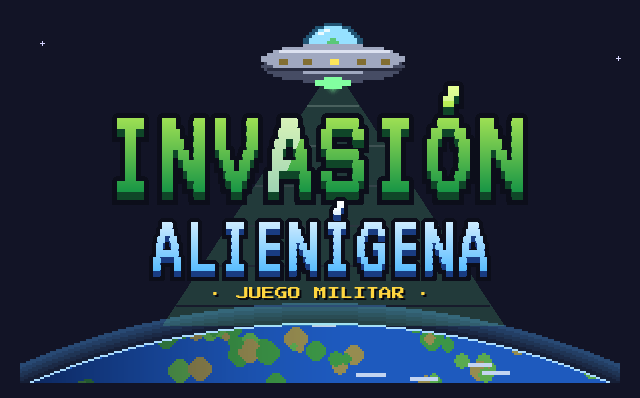

# Juego Militar: Invasión Alienígena



**Juega en el navegador:** https://abelber07.github.io/historygame/

Un juego de **Abel**, hecho con Python y Pygame. Es la versión mejorada y adaptada a la web de su juego original [`Joc_final`](https://github.com/abelber07/Joc_final).

## Historia

Año 2139. Sobre la Tierra se abren decenas de portales y por ellos llegan los Xylothians, una especie que no piensa por sí misma: todos sus soldados obedecen a una sola mente. Tras ocho años de guerra, las capitales han caído.

El ejército crea su última arma, el **Proyecto NEXUS**: un soldado con implantes que lo hacen inmune a la señal mental alienígena. En 2147 Nexus despierta en un búnker bajo la ciudad en ruinas y empieza su misión.

Nexus cruza las ruinas, la selva tecnológica y la fortaleza alienígena hasta derrotar al Comandante Supremo. Pero antes de caer, el Comandante llama a la **Nave Nodriza** que orbita la Tierra, y sus restos revelan la verdad: todos los Xylothians obedecen al **Núcleo de Xylos**, en su mundo de origen. Nexus tendrá que subir a la órbita y cruzar el último portal para acabar la guerra para siempre.

La primera vez que se abre el juego se ve una **animación inicial** que cuenta todo esto (se puede saltar con ESC y volver a ver desde *Historia*).

## Sectores

| Sector | Escenarios | Jefe |
|---|---|---|
| 1. Ruinas Urbanas | 1-1 a 1-3 | General Xylothian |
| 2. Selva Tecnológica | 2-1 a 2-3 | Maestro de la Selva |
| 3. Fortaleza Xylothian | 3-1 a 3-3 | Comandante de Élite y **Comandante Supremo** (jefe final) |
| 4. Órbita: la Nave Nodriza | 4-1 a 4-3 | **Nave Nodriza Xylothian** (jefe final) |
| 5. Xylos, el Mundo Colmena | 5-1 a 5-3 | Guardián de la Colmena y **Núcleo de Xylos** (jefe final) |

Cada jefe final tiene su propio patrón: el Comandante Supremo lanza anillos que giran, la Nave Nodriza deja caer cortinas de balas y llama refuerzos, y el Núcleo de Xylos dispara espirales, anillos con un hueco para esquivar y una mirada que te apunta.

Al completar un sector se desbloquea un expediente en **Historia**, con el trasfondo de los Xylothians. Al derrotar a cada jefe final se ve una **cinemática** (la señal del Comandante Supremo, la explosión de la Nave Nodriza y el final), que también se puede volver a ver desde Historia.

Durante los escenarios hablan por **radio** el comandante Reyes, la doctora Vega (creadora del Proyecto NEXUS), el propio Nexus... y, en los últimos sectores, la mente de Xylos. Cada jefe tiene una **presentación** al aparecer.

## Enemigos, peligros y oleadas

- **Voladores**: drones, lugartenientes y cazadores que embisten.
- **De suelo** (nuevos): el **soldado** camina por las plataformas y dispara en línea recta; el **escudero** lleva un escudo de energía que para todo lo que le llega de frente (hay que rodearlo; el plasma lo atraviesa); el **kamikaze** corre hacia ti y explota (si lo abates, la explosión daña a los demás aliens).
- **Peligros** de cada escenario: escombros que caen en las ruinas, morteros en las murallas (primero sale una marca en el suelo), charcos de ácido en la selva y la colmena, gas tóxico en el laboratorio, suelo electrificado en el patio y el hangar, plataformas que flotan y se mueven en órbita y plataformas que se rompen si te quedas encima.
- Casi todos los escenarios tienen **dos oleadas**: cuando acabas con la primera llegan refuerzos.

## Estrellas, supervivencia y dificultad

- Cada escenario da hasta **3 estrellas**: completarlo, acabarlo antes de un tiempo (el cronómetro está arriba a la derecha) y hacerlo sin recibir daño. Cada estrella nueva da 30 XP para el Battle Pass.
- **Supervivencia** (se desbloquea al completar el sector 1): oleadas infinitas en la arena que elijas, cada vez más difíciles y con un jefe cada cinco. Se guardan los 5 mejores récords. Da la mitad de monedas y XP.
- **Dificultad** Fácil, Normal o Difícil en Opciones: cambia la vida, el daño y la cadencia de los enemigos (y las monedas que ganas).
- **Idioma**: español, catalán o inglés, en Opciones o con el icono del planeta arriba a la izquierda del menú (salen las banderas).

## Logros

28 logros de bronce, plata, oro y platino (el icono del trofeo, arriba a la izquierda del menú). Cada uno da monedas (50, 150, 400 o 1000). Además de los de la historia y los de habilidad, hay **logros secretos** que no dicen qué hay que hacer hasta conseguirlos (solo dan una pista): encontrar las placas de identificación escondidas en cada sector, reventar algo que te vigila desde el fondo del primer escenario, derribar uno de los ovnis del cielo, acabar el juego de cierta manera o introducir un código muy famoso en el menú. Al conseguir todos, el platino.

## Controles

| Tecla | Acción |
|---|---|
| A / D o flechas | Moverse |
| ESPACIO / W / flecha arriba | Saltar (mantén pulsado para saltar más; doble salto con los Propulsores) |
| S / flecha abajo | Bajar de una plataforma |
| MAYÚS / clic derecho | Voltereta: esquiva rodando sin recibir daño (también en el aire) |
| Clic izquierdo | Disparar (mantén pulsado con las armas automáticas) |
| 1-5 / Q / rueda del ratón | Cambiar de arma |
| P / ESC | Pausa |
| G | Volver al menú |
| M | Activar / silenciar el sonido |
| F11 | Pantalla completa |

## Armas y potencia

| Arma | Daño | Balas | Disparos/s | Potencia | Coste | Disponible tras |
|---|---|---|---|---|---|---|
| Pistola | 5 | 20 | 6 | 1 | Inicial | — |
| Escopeta | 6 × 6 perdigones | 12 | 1,8 | 2 | 500 | 1-2 |
| Fusil | 15 | 30 | 6,7 | 3 | 900 | 1-3 |
| Minigun | 9 (se calienta) | ∞ | hasta 12 | 4 | 1800 | 3-1 |
| Cañón de plasma | 45 (atraviesa enemigos y escudos) | 30 | 3,8 | 5 | 3000 | 4-2 |

Cada escenario tiene una **potencia máxima**: las armas más fuertes se bloquean (por ejemplo, en las ruinas inestables del sector 1, en el laboratorio con gas inflamable de la selva o en el campo supresor de la colmena). Si el arma equipada no está permitida, el juego elige la mejor que sí lo está. El selector de niveles muestra la potencia máxima de cada escenario.

## Opciones

Desde el menú (y desde la pausa) se puede ajustar el **volumen de la música** y el **de los efectos** por separado, elegir **pantalla completa o ventana**, el **escalado** (suave o nítido), la **dificultad**, el **idioma** y si se muestran los **números de daño**. Todo se guarda.

El juego se dibuja a **960x540** (panorámico 16:9). En un monitor de **1920x1080** se amplía exactamente **x2**: cada píxel del juego son 2x2 píxeles de la pantalla, sin suavizado y sin bandas negras, así que se ve totalmente nítido (y lo mismo a x3 en 2880x1620 o x4 en 4K). En otras resoluciones se usa el escalado elegido en Opciones. En el navegador el lienzo también es de 960x540 y, si la ventana es justo el doble (1920x1080 a pantalla completa), se muestra píxel a píxel.

## Tienda

- **Armas**: compra y equipa las cinco armas. Algunas no se pueden comprar hasta que avanzas en la historia.
- **Mejoras** (cada nivel también tiene un requisito de historia): Blindaje (+20 de vida), Potencia (+15% de daño), Cargadores (+30% de munición), Imán (atrae los objetos), Reflejos (velocidad e invulnerabilidad) y Propulsores (doble salto).
- **Aspecto**: uniformes, aspectos de arma (cambian el color del metal y de las balas) y títulos.

## Battle Pass

Ganas XP eliminando enemigos y completando escenarios (más XP la primera vez). Cada 200 XP subes un nivel del Battle Pass, hasta 20, y desbloqueas monedas y cosméticos exclusivos: uniformes Desierto, Ártico, Nocturno, Élite roja, Cibernético y Dorado; aspectos de arma Tóxico, Plasma azul, Infierno, Arcoíris y Dorado; y títulos como «Cazador de aliens» o «Leyenda de Xylos».

## Novedades

**Versión 3.7: Nexus renovado**
- **Nexus nuevo, mucho más detallado**: casco con el visor cian, auricular y luz, cara visible bajo el visor, chaleco táctico con bolsillos, mochila, cinturón, rodilleras, guantes y botas con suela. Está dibujado con el doble de resolución que antes y es un poco más grande (su zona de impacto también: 28 × 66 píxeles).
- **Armas del mismo estilo**: pistola, escopeta con corredera de madera, fusil de madera y metal con cargador curvo, minigun de tres cañones con caja de munición y cañón de plasma con bobinas que brillan. Cada una con su postura de brazos.
- **Animaciones nuevas**: al correr las piernas se doblan por las rodillas y las botas giran con el paso (punta abajo al impulsarse, arriba al aterrizar); también salto y caída nuevos.
- **Blindaje visible**: cada nivel de la mejora añade acero a Nexus (hombrera, peto, y casco reforzado con rodilleras). Los uniformes, aspectos de arma y camuflajes pintan el nuevo Nexus.
- **Tienda** (antes Arsenal) con tres pestañas: *Diaria* (ofertas del día), *Armas* y *Mejoras*. Las armas se ven solas y, al hacer clic, se abre su ficha: tu Nexus con el arma en las manos (disparando de vez en cuando) y todos sus datos: daño, disparos por segundo, cargador, precisión, modo, alcance, potencia y maestría.
- **Personalizar**: uniformes, aspectos de arma, camuflajes, títulos, estelas, efectos, miras, HUD, tarjetas y drones se cambian haciendo clic en Nexus en el centro del menú (con un punto rojo cuando hay algo nuevo).
- Los sprites de Nexus se generan con `tools/generar_nexus.py`.

**Versión 3.6: menú nuevo**
- **Menú rediseñado**: en vez de una columna de botones, cinco botones grandes con icono (*Jugar*, *Arsenal*, *Battle Pass*, *Colección* y *Diario*) y una barra de iconos arriba (idioma, logros, novedades, guía, opciones, créditos y salir). El fondo son los escenarios que ya has desbloqueado, que se van fundiendo.
- **Tu soldado en el menú**, en grande sobre un pedestal y con todo lo que llevas equipado: de vez en cuando dispara a un dron de prácticas (con tu camuflaje y tu efecto de eliminación) o hace una voltereta con tu estela. El dron compañero le sigue.
- **Panel Destacado** que va rotando: próxima recompensa del Battle Pass, reto de hoy, ofertas del día, próximo rango, maestría del arma equipada y desafíos. Al hacer clic te lleva a la pantalla correspondiente. Arriba, tu tarjeta de jugador con rango, temporada, monedas y estrellas.
- **Pantalla Jugar** con tres tarjetas animadas: *Historia* (continuar el siguiente escenario o elegir nivel), *Supervivencia* y *Desafíos*.
- **Revelaciones**: cada cosmético, rango, camuflaje o temporada nueva se presenta en una pantalla con rayos de luz y partículas antes de volver al menú (con *Saltar todo* si hay muchas).
- **Puntos rojos** en los botones donde hay algo nuevo que todavía no has mirado.
- **Guías animadas** de Maestría, Rangos, Bestiario, Desafíos y Diario, que salen solas la primera vez que entras (y todas en *Guía*).
- **Arsenal**: pestaña *Ofertas* con las ofertas del día y un botón de calculadora para canjear **códigos** (cada código sirve una vez por partida).
- **Reinicio general**: con esta versión todas las partidas guardadas empiezan de cero una sola vez (se conservan el idioma y las opciones).
- Transición suave entre pantallas, botones que brillan al pasar el ratón y *Borrar progreso* movido a *Opciones*.

**Versión 3.5: mucho más por desbloquear**
- **Maestría de armas**: cada arma sube del nivel 1 al 10 con las bajas que haces con ella (y da monedas en cada nivel). Desbloquea camuflajes de **bronce** (4), **plata** (7) y **oro** (10); con las cinco armas en oro, el camuflaje **diamante**, que brilla, y el título «Maestro de armas».
- **Cosméticos nuevos** en *Tienda > Aspecto*, ahora por categorías: **estelas** de voltereta, **efectos de eliminación** (desintegrar, confeti, congelar, electrocutar, agujero negro, lluvia de oro), **puntos de mira** de colores, **temas del HUD**, **tarjetas de jugador** y **drones compañeros** que te siguen por el escenario. Más uniformes, un aspecto de arma y títulos nuevos.
- **Rangos militares**: toda la XP cuenta para subir de Recluta a General de Galaxia (15 rangos), con insignia en la tarjeta del menú y una recompensa en cada ascenso.
- **Battle Pass por temporadas**: 50 niveles, cada uno pide un poco más de XP (200 + 10 por nivel). Al completarlo empieza otra temporada y ganas una estrella de prestigio; lo que ya tienes se cambia por monedas.
- **Bestiario** (en *Colección*): fichas de los 14 enemigos y jefes que se descubren al eliminarlos y una historia que se desbloquea al eliminar suficientes. Completo: tarjeta y título exclusivos.
- **Desafíos** que se abren con estrellas (desde *Jugar*): **Sector secreto** (15 ★), **Jefes seguidos** (30 ★, los ocho jefes uno tras otro) y **Pesadilla** (45 ★, el Núcleo más fuerte que nunca). Premios exclusivos la primera vez y mejor tiempo.
- **Diario**: tres **retos** nuevos cada día (200 monedas y 150 XP cada uno, y 300 más por hacer los tres). Las cuatro **ofertas** de cosméticos que cambian cada día están en *Arsenal > Ofertas*.
- **Equilibrio**: las mejoras de nivel 2 y 3 cuestan más y el nivel 3 pide estrellas; la minigun cuesta 2500 y el plasma 4500; los logros dan XP; repetir un escenario ya completado da la mitad de monedas. Las partidas antiguas conservan todo lo conseguido.

**Versión 3.4.1: combates más fluidos**
- La Nave Nodriza ya no se inclina girando a saltos (con un sprite tan grande parecía que el juego fuera a menos FPS): se mueve entera y suave.
- Las plataformas flotantes van a velocidad constante (1 píxel por fotograma) con una pausa en cada extremo, en vez de avanzar a batzegadas.
- Los golpes de las armas pesadas a los jefes, la fase de furia y la muerte de un jefe ya no congelan la imagen: el jefe retrocede unos píxeles, hay destello y la pantalla tiembla.
- Los focos de alarma de la Nave Nodriza se dibujan en capas pequeñas en vez de capas de pantalla entera.

**Versión 3.4: interfaz nueva**
- **Últimas actualizaciones**: si ya habías jugado, al abrir una versión nueva aparece antes del menú una pantalla animada con las novedades (y las de versiones anteriores). También se puede abrir con el icono del periódico, arriba a la izquierda del menú. Quien juega por primera vez no la ve.
- **HUD rediseñado** en paneles: arriba a la izquierda la vida, la voltereta, las mejoras activas y el Battle Pass; arriba a la derecha las monedas (que suben contando), el sector, los enemigos y el cronómetro; abajo a la izquierda el arma con su icono y la munición en balitas (o la barra de calor de la minigun), y abajo a la derecha las cinco ranuras con icono, munición y un candado si el escenario no deja usar esa arma.
- **Vida**: los corazones tiemblan al recibir un golpe y la vida perdida se vacía poco a poco en blanco. Con poca vida la pantalla late en rojo y suena el corazón.
- **Voltereta**: un indicador que se rellena mientras se recarga y destella cuando vuelve a estar lista.
- **Mejoras a la vista**: iconos con su nivel que se iluminan cuando actúan (el imán atrae algo, el doble salto se gasta…). En el soldado se ven las placas del **blindaje** (hombrera, peto y casco), el campo del **imán**, las llamas de los **propulsores** y la estela de los **reflejos**; con blindaje, los golpes muestran un escudo hexagonal.
- **Barra del jefe** con retrato, segmentos, vida perdida en blanco y aviso de **¡FURIA!** al pasar del 50%.
- **Balas propias de cada arma**: trazadores de pistola, fusil y minigun (uno de cada tres más brillante), perdigones que se apagan y bolas de plasma con rayos. Las balas enemigas tienen contorno oscuro y formas propias (rombos, anillos, estrellas) para no confundirlas con las tuyas.
- **Disparos con más impacto**: fogonazo distinto para cada arma y orientado hacia donde apuntas, casquillos que rebotan en el suelo (cartuchos rojos en la escopeta, vapor en el plasma), chispas al impactar, polvo cuando una bala toca el suelo y un «ting» cuando un escudo para la bala.
- **Punto de mira según el arma** (el de la escopeta muestra hasta dónde se abren los perdigones), que se abre con el retroceso, y **marca de impacto** al acertar (roja al eliminar).
- Textos flotantes con contorno («+20 vida», «+12 balas») y **números de daño** sobre los enemigos (los golpes seguidos se suman). Se pueden quitar en **Opciones > Números de daño**.

**Versión 3.3**
- Las páginas de «Cómo funciona» ahora están animadas: el Battle Pass se llena y desbloquea recompensas, cada mejora se ve en acción, cada arma dispara contra drones (la minigun se calienta) y los logros, las estrellas y la supervivencia tienen su escena.
- Arreglado: con inglés o catalán, la escena del Proyecto NEXUS de la intro salía en español (y algún texto más).
- Arreglado: en el entrenamiento se podía cambiar de arma antes de tiempo y el paso de cambiar de arma se quedaba atascado. Ahora el fusil solo aparece en ese paso y, al acabar, vuelves a tener el arma que llevabas.
- Arreglado: las diagonales de la bandera inglesa se salían por las esquinas.

**Versión 3.2**
- La primera vez que se abre el juego: selector de idioma con banderas, la intro, un **entrenamiento jugable** con los controles (moverse, saltar, bajar, voltereta, disparar, cambiar de arma y recoger objetos) y unas páginas que explican el Battle Pass, las mejoras, las armas, las estrellas y los logros. Todo se puede repetir desde la Guía («Tutorial» y «Cómo funciona»).
- Minigun reequilibrada: 9 de daño (unos 110 por segundo en lugar de 250), no gasta munición pero **se calienta** y se bloquea si no sueltas el gatillo, tarda en arrancar y te frena mientras disparas. El cañón de plasma pasa a 45 de daño y 30 cargas: ahora sí es el arma más potente.
- Créditos nuevos con desplazamiento animado y pantalla de carga: un juego de Abel.

**Versión 3.1**
- Sistema de logros (28, con secretos, placas escondidas y platino) y avisos de logro desbloqueado.
- Iconos en el menú: el planeta para cambiar de idioma con banderas y el trofeo para ver los logros.
- Las cinemáticas ya no se aceleran con clic o ESPACIO: avanzan solas con tiempo para leer y se pueden saltar con el botón «Saltar» (o ESC).
- Arreglado el imán: los objetos solo se acercan si los puedes usar (vida o munición que no tengas al máximo); si no, se quedan donde están.

**Versión 3.0**
- Tres enemigos de suelo nuevos (soldado, escudero y kamikaze), peligros en los escenarios (escombros, morteros, ácido, gas, electricidad, plataformas móviles y frágiles) y oleadas de refuerzos.
- Voltereta con invulnerabilidad (MAYÚS o clic derecho), pequeña pausa al impactar con armas pesadas, al eliminar enemigos y al recibir daño, y retroceso de la escopeta, el plasma y la minigun.
- Estrellas por escenario, modo Supervivencia con récords y tres niveles de dificultad.
- Mensajes de radio con retrato, presentación de cada jefe y cinemáticas al derrotar a los tres jefes finales (el final del juego ahora es una animación en lugar de un texto).
- Seis canciones nuevas (sector 1, órbita, Xylos, jefes, supervivencia y final): ahora cada sector tiene su música.
- Todos los sprites se amplían a escalas enteras (x2, x3), así que sus píxeles se ven iguales y nítidos.
- En el navegador la música se descarga en segundo plano cuando hace falta: el juego tarda mucho menos en arrancar.
- Juego en español, catalán e inglés.

**Versión 2.3**
- Resolución base nueva de 960x540 (16:9): a 1920x1080 el juego se ve a x2 exacto, perfectamente nítido y sin bandas laterales.
- Los 15 fondos redibujados en panorámico, con el tamaño justo para que se pinten píxel a píxel.
- Menús, tienda, Battle Pass, Historia, opciones, HUD, intro y plataformas recolocados para la pantalla panorámica (el menú ahora tiene el logo a la izquierda y los botones a la derecha).
- El escalado x2 es más rápido que el anterior (unos 6,5 ms por fotograma a 1920x1080 en lugar de 8).

**Versión 2.2**
- Pantalla de Opciones con volumen de música y efectos, pantalla completa o ventana y escalado.
- El juego se adapta a la resolución del monitor (1920x1080 a pantalla completa) y llena la pantalla panorámica.
- Música menos fuerte por defecto (30%), recodificada con más calidad y margen para que no distorsione, y búfer de audio más grande para evitar chasquidos. La versión web ya no recomprime el audio (`--no_opt`).

**Versión 2.1**
- Todo el juego en español.
- Animación inicial que cuenta la historia en cinco escenas (portales, invasión, ocho años de guerra, Proyecto NEXUS y el despertar de Nexus).
- Fondos nuevos para los nueve escenarios de los sectores 1, 2 y 3, redibujados con más detalle a partir de la idea original: la torre de vigilancia alienígena en la ciudad, la lluvia con neones, la base del General con su cúpula, la pagoda devorada por la selva, el laboratorio con tanques de criaturas, el árbol-máquina en llamas, las murallas con el cohete, el patio interior con suelo de baldosas y la cima nevada con el portal tras el trono.
- Historia revisada para que todo encaje: por qué Nexus es inmune, de dónde vienen los portales y por qué el Comandante Supremo llama a la Nave Nodriza.
- «Battle Pass» e «Historia» en el menú.

**Versión 2.0**
- Dos sectores nuevos (6 escenarios), dos jefes finales nuevos (Nave Nodriza y Núcleo de Xylos), un jefe nuevo (Guardián de la Colmena) y un enemigo nuevo: el cazador, que se carga y embiste.
- Dos armas nuevas (escopeta y cañón de plasma), potencia de arma por escenario y cambio de arma durante la partida.
- Tienda con pestañas de armas, mejoras y aspecto, con compras que dependen del avance en la historia.
- Battle Pass de 20 niveles con aspectos exclusivos para el soldado y las armas.
- Animaciones de los enemigos: inclinación al moverse, propulsores, aviso luminoso antes de atacar, restos que caen al morir y secuencias de muerte de los jefes con explosiones encadenadas. El Comandante Supremo mueve los tentáculos y tiene una fase de furia, la Nave Nodriza tiene luces y cañones que se iluminan, y el ojo del Núcleo sigue al jugador y parpadea.

**Versión 1.1**
- Animaciones del soldado: correr, reposo, salto, caída, aterrizaje, retroceso, fogonazo, casquillos, polvo y caída al morir. Las balas salen de la punta del arma y la sombra se proyecta sobre la plataforma de debajo.
- Fondos con paralaje y ambiente animado en cada escenario, logotipo nuevo animado e icono nuevo.

**Versión 1.0 (errores corregidos del juego original)**
- El bucle principal no cedía el control (`await asyncio.sleep(0)`) y bloqueaba la pestaña del navegador.
- Los eventos se leían dos veces por fotograma: se perdían clics y teclas.
- El botón «Continuar» de la victoria reiniciaba el combate contra el jefe final.
- La barra de vida del jefe del sector 2 se rellenaba a mitad de combate.
- Los enemigos podían quedarse fuera de la pantalla, donde las balas no llegaban.
- Se podía saltar en el aire después de caer de una plataforma.
- La música se cargaba entera en memoria; ahora se reproduce en streaming (OGG).
- Recursos optimizados de 46 MB a unos 10 MB y guardado automático del progreso.

## Ejecutarlo en el ordenador

```bash
pip install -r requirements.txt
python main.py
```

Para probar la versión web en local:

```bash
pip install pygbag
pygbag .
# y abre http://localhost:8000
```

## Publicación

GitHub Pages publica la raíz de la rama `main` (**Settings → Pages → Deploy from a branch: main / root**). La versión web compilada son los archivos `index.html`, `historygame.tar.gz` y `historygame.apk` de la raíz.

Cuando se sube un cambio a `main.py`, `dades.py` o `assets/`, el workflow `.github/workflows/pages.yml` recompila el juego con pygbag, actualiza esos archivos y vuelve a publicar la página.

## Herramientas

- Python y Pygame (pygame-ce), con asyncio para el bucle principal.
- pygbag para ejecutarlo en el navegador con WebAssembly.
- Gráficos originales del soldado y los enemigos de Abel; efectos de sonido y parte de la música libres de derechos.
- Los fondos de los cinco sectores, los jefes finales nuevos, el cazador y las armas nuevas se generan con `tools/generar_assets.py`; los enemigos de suelo y los retratos de la radio con `tools/generar_sprites.py`, las seis canciones nuevas con `tools/generar_musica.py` (síntesis chiptune con numpy) y los sonidos del latido, el «ting» del escudo y la marca de impacto con `tools/generar_sons.py`.
- Los textos están en español en el código; `idiomes.py` y `traduccions.py` tienen el catalán y el inglés.
- Los datos del juego (armas, niveles, historia, mejoras, Battle Pass y la lista de novedades `NOVETATS`) están en `dades.py`, y el contenido desbloqueable (cosméticos, rangos, maestría, bestiario, desafíos y retos) en `contingut.py`, para equilibrarlo fácilmente. Los nombres de variables del código siguen en catalán.
